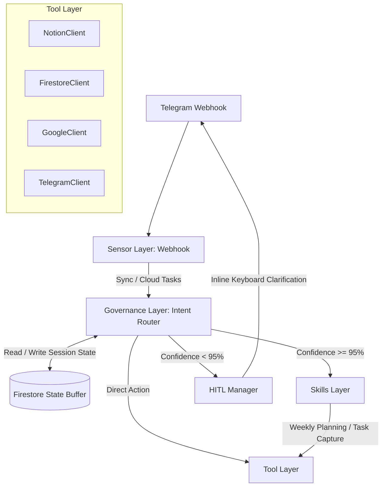

# Project Audit: Telegram Bot Notion Second Brain Orchestrator (PRJ226)

This document provides a comprehensive technical audit of the **telegram-notion-second-brain** system. It is designed to serve as a complete project context file for LLMs (such as Gemini Deep Think) that do not have prior training or conversational history with this repository.

---

## 1. Project Overview & Tech Stack

The project is a serverless conversational productivity assistant that orchestrates a **Notion Second Brain** (based on PARA/3-Tier DB methodology) via a **Telegram Bot** integrated with **Gemini AI**.

### Tech Stack
*   **Language**: TypeScript (v5.3.3)
*   **Runtime**: Node.js (v20+)
*   **Hosting & Webhook**: GCP Functions Framework (v3.5.1) for serverless HTTP webhook.
*   **State Management Layer**: GCP Firestore (Native Mode) acting as a state buffer to handle stateless transitions.
*   **Generative AI**: `@google/generative-ai` (v0.21.0) with dynamic, env-driven dual-model routing.
*   **Database (Permanent)**: Notion SDK (`@notionhq/client` v2.2.15).
*   **Integrations**: `googleapis` (v173.0.0) for Google Calendar busy slot lookups.

---

## 2. System Architecture: 4-Layer Closed-Loop System

The system decoupling is structured into four specialized layers alongside an evaluation suite.



### 2.1 Sensor Layer (`src/sensors/`)
Handles intake of text, audio/voice, or URL signals from the Telegram webhook, normalizes the input, and delegates thread execution.
*   [eventDispatcher.ts](file:///Users/dangnguyen/Desktop/PRJ226/src/sensors/eventDispatcher.ts):
    *   If `QUEUE_MODE === 'sync'`: Inline, synchronous dispatch (used for local testing).
    *   If `QUEUE_MODE === 'cloud_tasks'`: Pushes the update to a GCP Cloud Tasks queue to trigger `/worker` asynchronously. Returns HTTP 200 OK immediately to Telegram to prevent duplicate deliveries.
*   [voiceProcessor.ts](file:///Users/dangnguyen/Desktop/PRJ226/src/sensors/voiceProcessor.ts):
    *   Ingests `.ogg` audio files from Telegram.
    *   Sends binary data inline (`audio/ogg`) to Gemini LITE model to transcribe.
    *   Regex-filters common Vietnamese filler words (`ờ`, `à`, `ừ`, `uh`, `uhm`, `thì`, `là`, `kiểu`...) and normalizes spaces before routing.

### 2.2 Governance Layer (`src/governance/`)
Orchestrates request routing using probabilistic intent evaluation.
*   [intentRouter.ts](file:///Users/dangnguyen/Desktop/PRJ226/src/governance/intentRouter.ts):
    *   Uses Gemini LITE to classify intent: `Add Task`, `Rescue`, `Highlight`, `Weekly Planning`, `Unknown`.
    *   **Confidence $\ge$ 95%**: Auto-routes payload directly to Skills or Tools.
    *   **Confidence < 95%**: Hands off to the `hitlManager` to prompt the user.
    *   **Decoupled Error Handling**: Wraps the core handler in a global `try-catch` to notify the user via Telegram on API errors (Graceful Degradation).
*   [hitlManager.ts](file:///Users/dangnguyen/Desktop/PRJ226/src/governance/hitlManager.ts):
    *   Saves the ambiguous state in Firestore under `AWAITING_HITL_CONFIRMATION` (with original text and AI's best guess).
    *   Presents an inline keyboard asking the user to confirm their intent.
    *   Appends a `[❌ Hủy bỏ]` button pointing to `hitl_cancel` to immediately wipe Firestore state.
    *   Enforces a 5-minute TTL on session states; expired states are cleared, treating the next input as a fresh intent.

### 2.3 Tool Layer (`src/tools/`)
Contains deterministic integrations for external APIs. No AI reasoning occurs here. Error handling, retries, and rate limits are managed in this layer.
*   [notionClient.ts](file:///Users/dangnguyen/Desktop/PRJ226/src/tools/notionClient.ts):
    *   Handles Notion queries and page updates.
    *   Implements exponential backoff retries defensively on HTTP 429 Rate Limits and enforces a 100ms safety throttle.
*   [firestoreClient.ts](file:///Users/dangnguyen/Desktop/PRJ226/src/tools/firestoreClient.ts):
    *   Manages user sessions (with 5-minute TTL), planning drafts (with 15-minute TTL), and system stats.
    *   Falls back to in-memory mocks when `NODE_ENV === 'test'` for offline testing.
*   [googleClient.ts](file:///Users/dangnguyen/Desktop/PRJ226/src/google/client.ts):
    *   Fetches events from Google Calendar to map busy slots.
*   [telegramClient.ts](file:///Users/dangnguyen/Desktop/PRJ226/src/telegram/client.ts):
    *   Sends/edits Telegram text messages, downloads files, and processes callback queries.

### 2.4 Skills Layer (`src/skills/`)
Implements complex, stateful multi-tool workflows.
*   [taskCaptureSkill.ts](file:///Users/dangnguyen/Desktop/PRJ226/src/skills/taskCaptureSkill.ts):
    *   Parses natural language task specifications, fuzzy matches projects, generates prefixes, and writes the task into Notion.
*   [weeklyPlanningSkill.ts](file:///Users/dangnguyen/Desktop/PRJ226/src/skills/weeklyPlanningSkill.ts):
    *   Gathers Google Calendar events and existing Notion tasks to generate a consolidated list of "busy slots".
    *   Feeds these busy slots into Gemini PRO to build a conflict-free weekly schedule.
    *   Saves the plan as a draft in Firestore and sends a preview message with confirmation inline buttons (`Confirm`/`Cancel`).
    *   Upon confirmation, commits tasks sequentially to Notion with a 350ms throttle delay.

---

## 3. Notion 3-Tier Database Schema

The system integrates with 5 Notion databases, mapping relations as follows:

```
      +-------------+
      |    Areas    |<--------------+
      +------+------+               |
             |                      |
             | (1:N)                | (1:N)
             v                      |
      +------+------+        +------+------+
      |   Projects  |        |  Resources  |
      +------+------+        +-------------+
             |
             | (1:N)
             v
      +------+------+        +-------------+
      |    Tasks    |<------>|  Daily Logs |
      +-------------+ (N:1)  +-------------+
```

1.  **`Areas` (Lĩnh vực)**: High-level categories (e.g. Work, Health). Relates to Projects and Resources.
2.  **`Projects` (Dự án)**: Active initiatives. Properties: `Name`, `Status` (`Active`, `Done`, etc.), `Area` (Relation), `Tasks` (Relation).
3.  **`Tasks` (Công việc)**: Actionable tasks. Properties:
    *   `Name` (Title): Prefixed as `<Project_Name>_T<Sequential_Number>: <Task_Name>`
    *   `Status` (Select): `Not Started`, `On Hold`, `In Progress`, `Done`, `Archived`
    *   `Priority` (Select): `High`, `Medium`, `Low`
    *   `Estimate` (Number): Expected duration in hours.
    *   `Date` (Date): Start and end times.
    *   `Project` (Relation to Projects)
    *   `Daily Log` (Relation to Daily Logs)
4.  **`Daily Logs` (Nhật ký)**: Daily records. Properties: `Name` (`YYYY-MM-DD`), `Date`, `Highlight` (Rich Text), `Tasks` (Relation).
5.  **`Resources` (Tài nguyên)**: Bookmarks. Properties: `Name`, `URL`, `Area` (Relation).

---

## 4. Multi-Model Gemini Routing Strategy

Model selection is strictly env-driven (via [config.ts](file:///Users/dangnguyen/Desktop/PRJ226/src/config.ts)) and configured via two conceptual tiers:

1.  **Lightweight Tier (`MODELS.LITE` / `GEMINI_MODEL_LITE`)**
    *   *Default*: `gemini-3.1-flash-lite`
    *   *Usage*: High-frequency, structured parsing.
        *   Intent Routing (`classifyIntent`)
        *   Single-task parsing (`parseTaskInput`)
        *   Language translation for Highlights (`translateHighlight`)
        *   URL classification (`classifyResource`)
2.  **Advanced Tier (`MODELS.PRO` / `GEMINI_MODEL_PRO`)**
    *   *Default*: `gemini-3.1-flash`
    *   *Usage*: Low-frequency, complex reasoning and optimization.
        *   Weekly retrospective analysis (`analyzeWeeklyReport`)
        *   Weekly planning & scheduling (`planWeeklySchedule`) with busy slot reconciliation.
    *   *Failover*: If the PRO model encounters HTTP 503 (Overloaded), the system automatically retries and falls back to LITE to maintain availability.

---

## 5. Core Business Workflows

### 5.1 Task Capture with Sequential Prefixing
*   *Input*: `/add_task Nghiên cứu đối thủ cạnh tranh cho dự án PRJ226, độ ưu tiên High, dự tính 2h`
*   *Process*:
    1.  Uses LITE tier to extract: `name` ("Nghiên cứu đối thủ cạnh tranh"), `projectName` ("PRJ226"), `priority` ("High"), `estimate` (2.0), and generates a checklist.
    2.  Fuzzy matches the project name `PRJ226` in Notion.
    3.  Queries Notion for existing tasks related to this project.
    4.  Auto-prefixes the task title (e.g. `PRJ226_T3: Nghiên cứu đối thủ cạnh tranh`).
    5.  Creates the Notion page and appends checklist items as `to_do` blocks.

### 5.2 Task Completion, Deferral & Rollover
*   *Logic*:
    *   `/view_task` displays today's tasks with inline buttons (`[✅ Complete]` and `[⏳ Defer]`).
    *   Clicking `[✅ Complete]` updates the Notion status to `Done`.
    *   Clicking `[⏳ Defer]` or sending natural language text like `"Chưa xong, dời sang ngày mai"`:
        1.  Fetches checklist blocks of the current task.
        2.  Calculates completed vs. uncompleted checkbox counts.
        3.  Updates the original task's `Estimate` to reflect earned value (decreases by 50%) and marks it `Done`.
        4.  Clones the task for tomorrow with the name `[Rollover] <Original_Name>` (preserving prefix).
        5.  Migrates only the uncompleted checklist items as `to_do` children under the new task.

### 5.3 Focus Rescue Engine
*   *Input*: `/rescue`
*   *Process*:
    1.  Queries the Notion Tasks DB for active (non-`Done`) tasks.
    2.  Filters tasks where `Priority === 'High'` and `Estimate <= 0.5` (30 minutes).
    3.  Returns the earliest scheduled task to eliminate choice paralysis.

### 5.4 Daily Highlight
*   *Input*: `/highlight Đạt được cột mốc quan trọng trong tối ưu DB`
*   *Process*:
    1.  Uses Gemini LITE to translate the highlight text into English: `"Achieved critical milestone in database optimization"`.
    2.  Locates/creates the Daily Log page for today (`YYYY-MM-DD`).
    3.  Updates the `Highlight` text property on the Notion page.

### 5.5 Weekly Retrospective (Liam Persona)
*   *Input*: `/weekly_report`
*   *Process*:
    1.  Queries all tasks created or completed during the current week.
    2.  Calculates hard metrics:
        *   **Slippage Rate** = (Deferred or Rescheduled Tasks / Total Planned Tasks) * 100%
        *   **Velocity Score** = Sum of `Estimate` values for all `Done` tasks.
        *   **PM Framework Classification** = Discovery vs. Delivery ratio (analyzing task names via Gemini).
    3.  Sends these metrics in a JSON payload to Gemini PRO.
    4.  Generates a personalized retrospective mentorship review adopting the persona **Mentor Liam** (encapsulating constructive critiques and bottlenecks analysis).

### 5.6 Conversational Weekly Planning (V2 Scheduler)
*   *Input*: `/plan_week <Long description of weekly commitments>`
*   *Process*:
    1.  **Busy Slots Aggregation**: Queries Google Calendar events and Notion tasks scheduled for the upcoming week in parallel.
    2.  **AI Scheduling (Gemini PRO)**: Generates a JSON list of tasks matching the `weeklyScheduleV2Schema`. Enforces strict rules:
        *   *80/20 Rule*: Max 3 High Priority tasks per day.
        *   *Action-Oriented*: Re-titles tasks with active verbs (e.g. "Build", "Write").
        *   *Temporal Tetris*: Work tasks scheduled in 09:00 - 18:00 window (Mon-Fri); personal growth tasks in 20:00 - 22:30 window or weekends. No overlaps allowed.
        *   *Zero Free Slots*: Low priority tasks are pushed to the next available day when slots are filled.
    3.  **Draft Preservation**: Project relations are resolved via fuzzy name matching. The batch plan is saved in Firestore as a draft (15-min TTL) and a preview containing task schedules and details is sent to the user.
    4.  **Bulk Commit**: When the user presses `[✅ Tạo tất cả]`, the draft is loaded, and tasks are created sequentially in Notion. A **350ms throttle delay** is enforced between API writes to stay safely below Notion's rate limits. Once complete, deep links (`notion://`) are returned.

---

## 6. Testing & Quality Guardrails

### 6.1 Local Test Harness (`tests/`)
*   [localTest.ts](file:///Users/dangnguyen/Desktop/PRJ226/tests/localTest.ts):
    *   Simulates Telegram webhook payloads and triggers the routing system.
    *   Forces `QUEUE_MODE = 'sync'` and `NODE_ENV = 'test'` to bypass real network dependencies (uses in-memory mocks for Firestore, Notion, Google Calendar, and Gemini).

### 6.2 Evaluation Suite (`evals/`)
*   [golden-dataset.json](file:///Users/dangnguyen/Desktop/PRJ226/evals/golden-dataset.json):
    *   Contains 50-100 ground-truth conversation samples mapped to their expected intent classifications.
*   [run-evals.ts](file:///Users/dangnguyen/Desktop/PRJ226/evals/run-evals.ts):
    *   Uses the **live Gemini LITE API** to run intent classifications across the entire golden dataset.
    *   To avoid hitting rate limits on the Gemini API, it enforces a **4.5-second throttle delay** between test cases.
    *   **Accuracy Threshold**: A strict check enforces **$\ge 95\%$ accuracy**. If the test runner gets below 95%, it exits with code `1`, breaking CI/CD pipelines. This runner is decoupled from regular tests and runs via `npm run evals` or git hooks.

---

## 7. Execution Commands

*   **Build**: `npm run build`
*   **Start Local server**: `npm run start`
*   **Run Local mocks**: `npm test`
*   **Run Evaluation Suite**: `npm run evals` (forces `process.env.NODE_ENV = 'evals'`)
*   **Deploy (GCP)**: `npm run deploy` (deploys `telegram-notion-bot` using `gcloud functions`)
